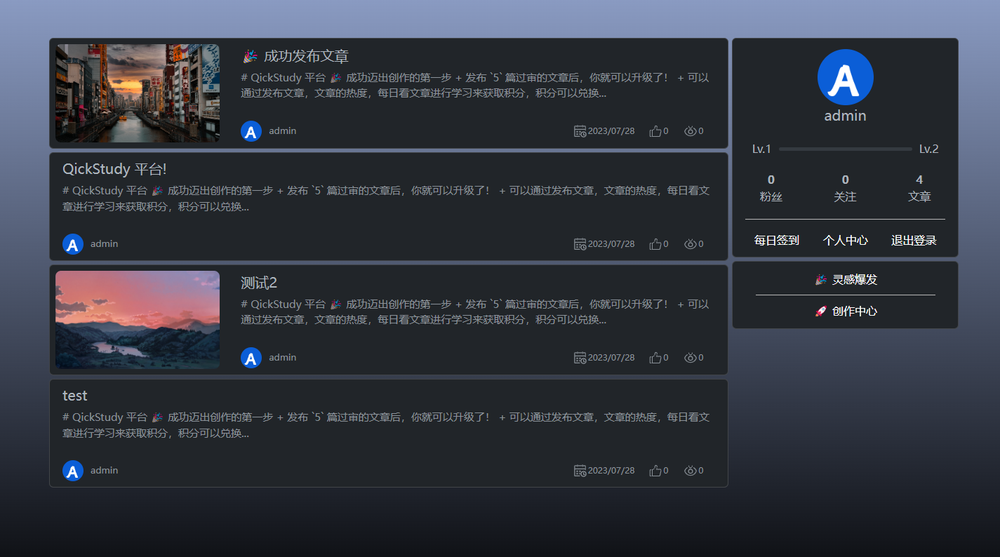
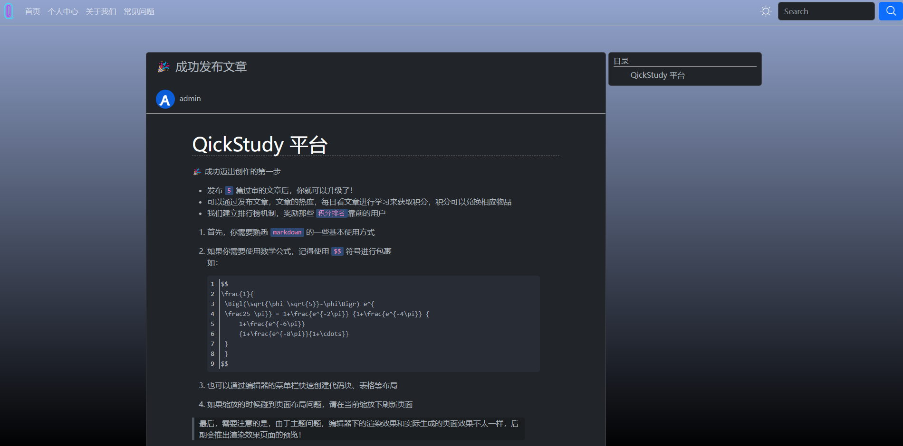
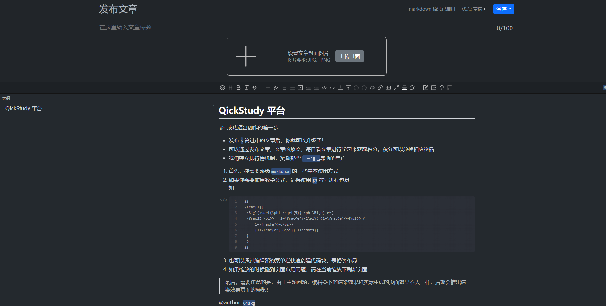
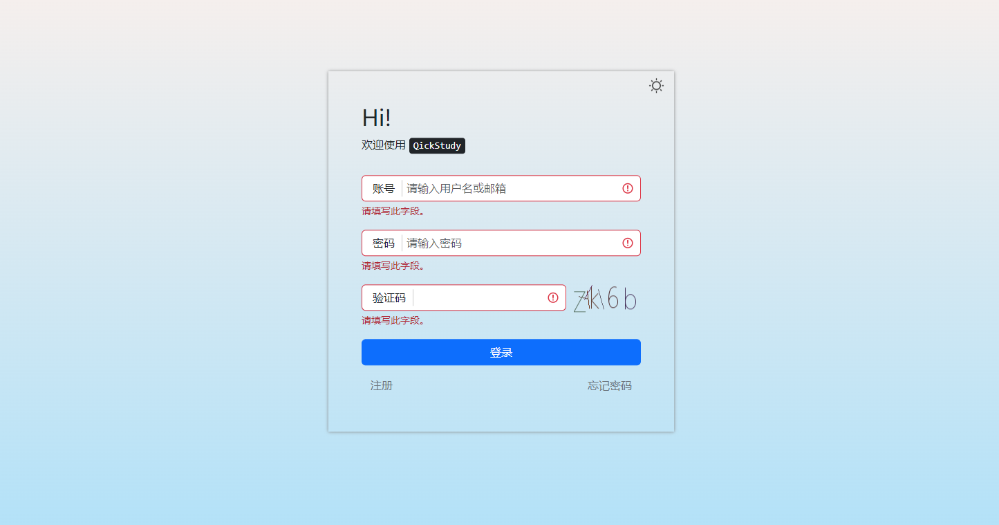

# QickStudy(快学平台)

<div align="center"></div>
<br>
<div align="center">
<a href='https://www.murphysec.com/console/report/1674402525447217152/1674402525975699456'></a>
</div>

### 0x01 前言

基于 `Flask` 框架实现的多用户学习论坛。
采用可移植性数据库，可实现不同服务器上的快速部署

### 0x02 功能亮点

1. 不同用户权限分割
2. 支持 `markdown` 文档
3. 支持在线编辑 `markdown` 文档并实时渲染、存储
4. 支持用户文章数统计、打卡统计，用户文章发表和点赞
5. 自动生成周报，统计每周好文章
6. 自动生成好文海报，快速分享知识
7. 多主题一键切换

<div align="center"></div>
<div align="center"></div>
<div align="center"></div>
<div align="center"></div>


### 0x03 部署

1. 安装依赖

   ```bash
   conda create -n QickEnv python=3.7
   conda activate QickEnv
   cd requirements
   pip install -r requirements.txt -i https://pypi.tuna.tsinghua.edu.cn/simple
   ```
2. 准备

   + 启动前需开启 `mysql` 数据库,并编辑 `config.py` 中的值

   ```python
   SQL_USER = "root"          #目标数据库用户名
   SQL_PASSWORD = "123456"    #目标数据库密码
   SQL_PORT = "3306"          #目标数据库端口
   SQL_SCHEMA = "QickStudy"   #目标数据库
   ```
   + 项目依赖了 `redis` 作为中间件,编辑 `config.py` 中的值对项目的 `redis` 进行配置

   ```python
   REDIS_URI = "127.0.0.1"       #redis 地址
   REDIS_PORT = 6379             #redis 端口
   REDIS_PASSWORD = "QickStudy"  #redis 密码
   ```
   
   其中，`REDIS_PORT` 字段为 `int` 类型
   ```python
   #REDIS
   REDIS_URI = "ip"
   REDIS_PORT = port
   ```

3. 部署
   部署前请开启数据库和中间件 `redis` 服务
   ```bash
   python QickStudy.py deploy
   ```

4. 启动服务

   ```bash
   python QickStudy.py runserver -h ip -p port --threaded
   ```

### 0x04 致谢

项目依赖了以下(但不限于以下)开源项目

+ `vditor`
  
  [https://github.com/Vanessa219/vditor](https://github.com/Vanessa219/vditor)

+ `Flask`
  
  [https://github.com/pallets/flask](https://github.com/pallets/flask)
